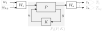

# sshinfcd - State-space $\mathcal{H}_\infty$ control design for LTI systems

[](https://doi.org/10.5281/zenodo.8010734)

`sshinfcd` is a MATLAB package facilitating multi-objective $\mathcal{H}_\infty$ controller synthesis with $\mathcal{D}$-stability constraints. It is a relatively straightforward implementation of a combination of the LMI formulations discussed in

* H. Köroğlu. ['H∞ synthesis with unstable weighting filters: An LMI solution.'](http://dx.doi.org/10.1109/CDC.2013.6760244) 52nd IEEE Conference on Decision and Control, pp. 2429-2434, 2013.
* M. Chilali and P. Gahinet. ['H∞ design with pole placement constraints: an LMI approach.'](http://dx.doi.org/10.1109/9.486637) IEEE Transactions on Automatic Control, vol. 41, no. 3, pp. 358-367, 1996. 

The work presented in the first reference has also been extended for descriptor realizations and impulsive weighting filters (see, e.g., [Feng & Yagoubi, 2016](https://doi.org/10.1016/j.automatica.2016.01.028) or [Feng et al., 2020](https://doi.org/10.1080/00207179.2018.1562223)). A general implementation of those techniques that is numerically sufficiently reliable for practical problems, however, turns out to be challenging. In addition, it has been shown that, if weighting filters are not impulsive, the problem can always be transformed into a format that can be solved with `sshinfcd` using regularization ([Bunjaku et al. 2018](https://doi.org/10.1109/ICCA.2018.8444268), [Wang et al., 1987](https://doi.org/10.1016/0167-6911(87)90028-4)). 

It is important to note that the The Mathworks' [Control System Toolbox](https://mathworks.com/products/control.html) for use with MATLAB also allows the same problem type to be solved using `systune`. In no way, this package aims at *competing* with these existing tools. Instead, we consider it to be *complementary*. Whereas `systune` is a lot more flexible in terms of specifications and structural constraints, it uses a nonconvex reformulation of the design problem, implying that the solution may heavily depend on the initial guess. When many initial guesses are required, the procedure also tends to become rather slow. In contrast, `sshinfcd` uses a classic convex approach by reformulating the problem as a semi-definite program (SDP) through linear matrix inequalities (LMIs). As long as the order of the system is moderate, modern SDP solvers can quickly return accurate results. The associated downside of an SDP reformulation is the conservatism that is introduced to render the formulation convex (see also [Scherer et al., 1997](https://doi.org/10.1109/9.599969)). Both solution methods are useful for practicing control engineers, depending on the needs of their specific problem at hand.

## Prerequisites

For using `sshinfcd`, The Mathworks' MATLAB and its Control System Toolbox are required. Moreover, `sshinfcd` does not solve the SDP itself but needs a 3<sup>rd</sup> party SDP solver. There are three options (that can be used next to each other) for that:
* You can use the LMI solver shipped with The Mathworks' [Robust Control Toolbox](https://mathworks.com/products/robust.html) for use with MATLAB. This one is referred to as [LMI Lab](https://nl.mathworks.com/help/robust/lmis.html).
* You can use any SDP solver that is interfaced through [YALMIP](https://yalmip.github.io/). Popular ones include [Mosek](https://www.mosek.com/), [SeDuMi](https://sedumi.ie.lehigh.edu/) and [SDPT3](https://blog.nus.edu.sg/mattohkc/softwares/sdpt3/). In that case, make sure you include YALMIP together with your favorite solver on your MATLAB path. 
* You can use any SDP solver that is interfaced through [CVX](http://cvxr.com/cvx/). Popular ones include [Mosek](https://www.mosek.com/), [SeDuMi](https://sedumi.ie.lehigh.edu/) and [SDPT3](https://blog.nus.edu.sg/mattohkc/softwares/sdpt3/). In that case, make sure you include CVX together with your favorite solver on your MATLAB path. 

## Usage

Consider the classic generalized feedback control configuration shown in the scheme below.

<p align="center"></p>

`sshinfcd` then aims to find the state-space system $K$ (= controller) as the solution of the multiobjective $\mathcal{H}_\infty$ optimization problem

$$
\begin{alignat}{2} 
    \underset{{K}}{\text{minimize}} \quad  &   \sum_ {i \in \mathbb{I}_ \text{o}} \alpha_ i \ \left\|\textrm{MR}\left[\mathbf{T}_ i\right]\right\|_ \infty \\
    \text{subject to} \quad                &   \left\|\textrm{MR}\left[{T}_ j \right]\right\|_ {\infty}  \leq 1, \forall j \in \mathbb{I}_\text{c} \\
                                           &   \text{MR}[W_o\mathcal{F}_l({P},{K})W_i] \text{ is } \mathcal{D}\text{-stable}
\end{alignat}
$$

In this problem, $\mathbb{I}_ \text{o}$ denotes the set of indices of the performance channels $T_i$ that are optimized, that is, their ( $\mathcal{H}_ \infty$ ) norm has a term in the objective function. Similarly, the indices of all performance channels $T_j$ for which a hard norm limit of 1 is imposed constitute the set $\mathbb{I}_ \text{c}$. The limit of 1 is not restrictive, since $P$, $W_o$ or $W_i$ can always be adequately scaled. $\alpha_i$ denote strictly positive weighting factors to combine different objectives. All performance channels are allowed to be MIMO, that is, $w_k$ and $z_l$ can be vectors. Finally, the minimal realization of the weighted feedback interconnection of $P$ and $K$, $W_o\mathcal{F}_l(P,K)W_i$, is enforced to be $\mathcal{D}$-stable, that is, all its poles are in $\mathcal{D}$. Because $W_o$ and $W_i$ are allowed to contain $\mathcal{D}$-unstable modes (as this is convenient for robust control design, see the examples), pole-zero cancellations of these $\mathcal{D}$-unstable modes are allowed in the closed loop. This is why the minimal realization $\text{MR}[\cdot]$ is explicitly written in the problem above. To obtain a numerically tractable optimization problem, we assume furthermore that $\mathcal{D}$ is a convex region of the complex plane characterized by a set of LMIs (see [Chilali and Gahinet, 1996](http://dx.doi.org/10.1109/9.486637)). 

**Warning**. Since the weighting filters of $W_o$ and $W_i$ are allowed to contain $\mathcal{D}$-unstable and $\text{MR}[W_o\mathcal{F}_l(P,K)W_i]$ is required to be $\mathcal{D}$-stable, the resulting $K$ will always exactly replicate the $\mathcal{D}$-unstable modes of $W_o$ or $W_i$. Since an unstable controller not implementable in practice, it is recommended to always choose the poles of $W_o$ and $W_i$ in the closed left half complex plane (with the imaginary axis as a limit case to enforce integrators in the controller). 


### Basic functionality

The following MATLAB pseudocode is, more or less, a literal transcription from the aforementioned problem.  

```matlab

Wi = ss(Ai,Bi,Ci,Di);                       % input filter
P = ss(Ap,Bp,Cp,Dp);                        % plant, with inputs ordered as [w;u] and outputs as [z;y]
Wo = ss(Ao,Bo,Co,Do);                       % output filter

solver = sshinfcd.sshinfcd();

% H-infinity specifications
specs = struct('in',[],'out',[],'weight',[]);

for i = 1:length(Io)                        % for all the performance channels that are optimized
    specs(i).in = wi;                       % wi are the indices of the inputs of P that are also the inputs of performance channel i
    specs(i).out = zi;                      % zi are the indices of the outputs of P that are also the outputs of performance channel i
    specs(i).weight = alphai;               % alphai is the weighting factor associated with the norm of performance channel i in the objective function
end
for j = (1:length(Ic))+length(Io);          % for all the performance channels that are constrained
    specs(j).in = wj;                       % wj are the indices of the inputs of P that are also the inputs of performance channel j
    specs(j).out = zj;                      % zj are the indices of the outputs of P that are also the outputs of performance channel j
    specs(j).weight = 0;                    % if weight is set to 0, specs(j) is treated as a constraint, i.e. |zj / wj| < 1
end

% D-stability specifications
region = struct('M',[],'L',[]);
for k = 1:length(lmis)
    region(k).L = lmis.L;                   % L = L', M and L define an LMI region 
    region(k).M = lmis.M;                   % size(L) == size(M), M and L define an LMI region
end

% set the problem
solver = solver.setproblem(P,Wi,Wo,specs,region);

% solve the problem
options = solver.options();                 % options: see next section
[K,gamma] = solver.solve(options);          % solve the problem, return the norms of the performance channels in the objective function (gamma) and the controller (K)

```

Numeric examples are provided in the [examples](examples/) folder. 

### Options

Although not mandatory, the user might want to alter several default options of `sshinfcd`. The easiest way to do so is by making changes in the structure with default options, which can be requested by invoking

```matlab
opts = solver.options();
```

where `solver` is an `sshinfcd` object. 

#### synthesis.gammasolver
The `opts.synthesis.gammasolver` field admits three options, all of which are strings:
* `'lmilab'` - uses [LMI Lab](https://nl.mathworks.com/help/robust/lmis.html) from The Mathworks' Robust Control Toolbox as SDP solver. (_default_)
* `'yalmip'` - uses [YALMIP](https://yalmip.github.io/) as backend to solve the SDP. Make sure YALMIP is on your MATLAB path. 
* `'cvx'`- uses [CVX](http://cvxr.com/cvx/) as backend to solve the SDP. Make sure CVX is on your MATLAB path. 

All of these three SDP solvers also offer the possibility to set options:

##### lmilab.options
If you are you are using LMI Lab as SDP solver, you can also set its options by altering the field `opts.lmilab.options`. This field contains a vector of length 5, the numbers of which are explained [on this page](https://nl.mathworks.com/help/robust/ref/mincx.html#f10-178720). The user can change them according to their own needs. The _default_ options set by `sshinfcd` are `[1e-6 500 0 0 0]`. 

##### yalmip.options
If you are using YALMIP as backend to solve the SDP set up by `sshinfcd`, you can also set the YALMIP options through the field `opts.yalmip.options`. Providing options to YALMIP is explained [here](https://yalmip.github.io/command/sdpsettings/) in more detail. Basically, you can just pass YALMIP's `sdpsettings` structure to `opts.yalmip.options`. The _default_ options are indeed assigned as `opts.yalmip.options = sdpsettings()`. 

##### cvx.options
If you are using CVX as backend to solve the SDP set up by `sshinfcd`, you can also set two CVX options:
* `opts.cvx.solver`: is passed as an argument to the `cvx_precision` command (_default_: `''`)
* `opts.cvx.solver_settings`: is passed as an argument to the `cvx_solver_settings` command (_default_: `''`)
* `opts.cvx.precision`: is passed as an argument to the `cvx_precision` command (_default_: `'default'`)
You can find more information on the CVX options [on this page](http://cvxr.com/cvx/doc/solver.html). 

#### synthesis.zerotol
Although the user is strongly discouraged to use this option, there are exceptional cases in which they might want to increase the tolerance with respect to semi-definiteness. The _default_ value of `opts.synthesis.zerotol` is 0, but when changed to a nonzero value $\epsilon$ all LMIs in the SDP set up by `sshinfcd` are changed as follows:

$$
\left\\{
\begin{array}{l}
A \succeq 0 \\
B \preceq 0
\end{array}
\right.
\quad
\Longrightarrow
\quad
\left\\{
\begin{array}{l}
A \succeq -\epsilon I \\
B \preceq \epsilon I 
\end{array}
\right.
$$

#### synthesis.lyapunovshape

In order to convexify the problem, `sshinfcd` looks for a common quadratic Lyapunov function that satisfies all performance constraints, just like other classic LMI approach to $\mathcal{H}_\infty$ control do. This is often referred to as 'Lyapunov shaping', a term coined by [Scherer et al., 1997](https://doi.org/10.1109/9.599969). The idea is easily summarized as follow. Let $\mathcal{A},\mathcal{B}_i,\mathcal{C}_i,\mathcal{D}_i$ be the closed-loop state-space matrices of performance channel $T_i$. Then, the associated bilinear matrix inequalities (BMIs) are

$$
\small
\left\\{
\begin{array}{l}
\mathcal{P}_i \succeq 0 \\
\begin{bmatrix}
\mathcal{A}^T\mathcal{P}_i + \mathcal{P}_i\mathcal{A} & \mathcal{P}_i\mathcal{B}_i & \mathcal{C}_i^T \\
& -\gamma I & \mathcal{D}_i^T \\
& & -\gamma I 
\end{bmatrix}
\preceq 0
\end{array}
\right.
\quad \Leftrightarrow \quad
\left\\{
\begin{array}{l}
\mathcal{P}_i \succeq 0 \\
\begin{bmatrix}
\mathcal{A}^T\mathcal{P}_i + \mathcal{P}_i\mathcal{A} & \mathcal{P}_i\mathcal{B}_i & \mathcal{C}_i^T \\
& -\gamma^2 I & \mathcal{D}_i^T \\
& & - I 
\end{bmatrix}
\preceq 0
\end{array}
\right.
\quad \Leftrightarrow \quad
\left\\{
\begin{array}{l}
\mathcal{P}_i \succeq 0 \\
\begin{bmatrix}
\mathcal{A}^T\mathcal{P}_i + \mathcal{P}_i\mathcal{A} & \mathcal{P}_i\mathcal{B}_i & \mathcal{C}_i^T \\
&  I & \mathcal{D}_i^T \\
& & -\gamma^2 I 
\end{bmatrix}
\preceq 0
\end{array}
\right.
$$

For every specification, these three BMIs are equivalent: they are related through a mere congruence transformation. To transform them into LMIs, however, the Lyapunov shaping paradigm proposes to fix $\mathcal{P}_ 1 = \mathcal{P}_ 2 = \ldots$. This additional (convexifying) coupling constraint obviously introduces some conservatism, but what is more, this conservatism also depends on the choice between one of the three formulations of the constraints (or, equivalently, on the realization of the plant and the input/output filters). The solutions of the three formulations will generally not yield the same performance level, unless the realization is properly scaled. 

* If you set `opts.synthesis.lyapunovshape` to 1, then the leftmost formulation is used.
* If you set `opts.synthesis.lyapunovshape` to 2, then the centered formulation is used.
* If you set `opts.synthesis.lyapunovshape` to 3, then the rightmost formulation is used. (_default_)
* If you set `opts.synthesis.lyapunovshape` to 4, then the problem is solved for all three formulations and the best solution is selected.

After the problem has been solved for the first time, `sshinfcd` rescales the generalized plant, the input/output filters and the objective terms with the achieved performance levels and solves the same problem once more. The reason for this is twofold:

1. Formulation 1 has a different objective function ( $\alpha_ 1 \gamma_ 1 + \alpha_ 2 \gamma_ 2 + \ldots$ ) than formulation 2 and 3 ( $\alpha_ 1 \gamma_ 1^2 + \alpha_ 2 \gamma_ 2^2 + \ldots$ ). By rescaling the plant such that all optimal values for $\gamma_i$ tend to approach 1, the formulations eventually become equivalent. 

2. By rescaling the plant such that the optimal values for $\gamma_i$ approach 1, the dependency of the conservatism on the realization fades away.

Note that this is a heuristic and is not guaranteed to eventually lead to the best achievable approximation of the original nonconvex problem (that is to say, we have actually never really formally looked into this heuristic so far). Also, we only solve the problem one more time after the initial solution, while multiple iterations would be needed for all $\gamma_ i$ to approach 1 arbitrarily close. 

## A note on LCToolbox

`sshinfcd` can also be used as a plugin for [LCToolbox](https://github.com/meco-group/lc_toolbox), a linear control toolbox for MATLAB supporting LTI and LPV controller design with $\mathcal{H}_\infty$ specifications. More details and design examples can be found in the work of [Verbandt et al., 2018](https://doi.org/10.1016/j.mechatronics.2018.04.007) and [Swevers et al., 2020](https://doi.org/10.1541/ieejjia.9.109).

## Using `sshinfd` and referring to it

`sshinfcd` is released under the LGPLv3 terms and conditions and can, thus, be freely used for both non-commercial and commercial use. Note that 3<sup>rd</sup> party plugins (such as YALMIP, CVX, and SDP solvers) that you can use with `sshinfcd` may still restrict applicability for your use case. 

If you use `sshinfcd` in your work, please cite 

* L. Jacobs and J. Swevers (2023). 'H∞ control design with D-unstable weighting filters and a D-stability constraint: Solution and applications'. Accepted for the 7th IEEE Conference on Control Technology and Applications (CCTA). 

The package is written by Laurens Jacobs, who is (at the time of development) financially supported by a postdoctoral research fellowship from [Flanders Innovation and Entrepreneurship](https://www.vlaio.be/en) (VLAIO) through project HBC.2021.0200. 
